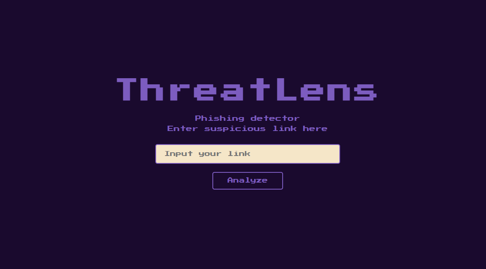
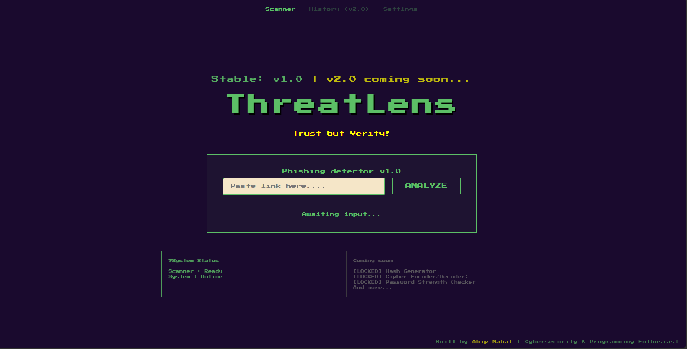

# Threatlens v1.0

Threatlens is an educational cybersecurity webapp desgined to server as a beginner toolkit. It contains features like suspicious links analyzer in the first version. I plan to update and expand threatlens on iterations, adding new layers and features on each iteration like hashes generator, cipher encoder and decoder, password strength checker, and much more.

Why did I build Threatlens?
I am deeply interested in cybersecurity and programming in general. I wanted to build a security tool for a long time but did not have enough experience in building complex tools. Also, I noticed how most people are aware of phishing but still slip and fall into the trap all the time. So I wanted to start building and contribute. Hence, came up with the idea of Threatlens, a cybsersecurity toolkit for beginners. So, I built it!

What Threatlens does?
In the current version (v1.0), threatlens helps users analyze suspicious links and detect phishing pattern. It waits for user input, passes it as json to the backend, where it gets analyzed and the backend returns the verdict along with risk score, and reasons why it is flagged (if flagged).

How it all fits together?
I used python for backend and js+css+html for frontend. The frontend sends the user entered URL in the form of JSON data, which then undergoes analysis. The core logic checks for several factors like url lenght, how many "." are present, presence of specific symbols and set of suspicious keywords like "lucky, winner, verify, paypa1, etc". Ultimately, based on those factors, it estimates a risk score (from 0-100, where 0 standing for safe) and returns the verdict, risk score as well as reason why it got that score in json form which is displayed to the user. 

Evolution of ThreatLens
| Initial Prototype | Final Dashboard |
|---|---|
|  |  |e 

LINK TO THE WEBAPP:
https://threatlens-iota.vercel.app/
